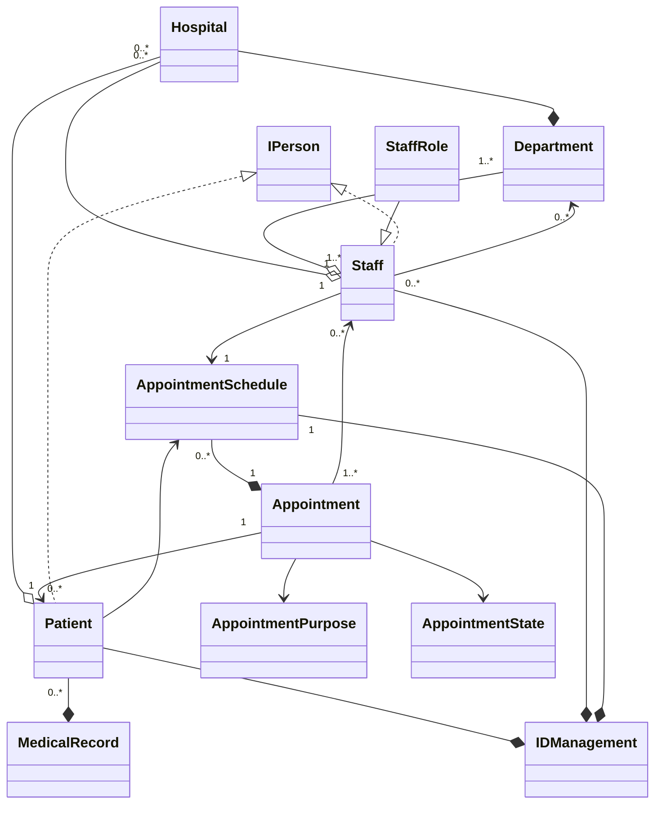
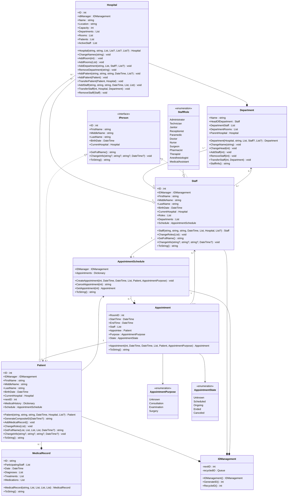

# **Опис предметної області**
У цьому проекті розробляється реалізація предметної області, що описує госпіталь. Після аналізу поданої предметної області було виокремлено 5 основних класи:
1.	Hospital (Госпіталь, як організація, що надає послуги пов'язані з здоров'ям кліенту. Головний клас цієї предметної області.);
2.	Department (Департамент госпіталю, в якому працює персонал госпіталю);
3.  Staff (Робітник госпіталю);
4.	Patient (Паціент госпіталю, він же клієнт);
5.	AppointmentSchedule (Система запису, яка організує зустрічи персоналу та кліентів на обмежений відрізок часу.);
6.  Appointment (Записи зустріч між персоналом та кліентами. Клас який поеднує паціентів та працівників госпіталю.);

Було також визначено всі необхідні для роботи основних класів перелічення, інтерфейси та класи, а також типи зв’язків між ними. На основі цього, було побудовано діаграму класів, яку можна побачити на рисунку 1:

Рисунок 1 – Виявлення та визначення елементів предметної області та зв’язки між ними

Для кожного з присутніх на діаграмі класів елементу було визначено його властивості та поведінку, які було позначено на діаграмі класів. Результат можна побачити на рисунку 2:

Рисунок 2 – Детальне проєктування елементів моделі предметної області

Далі наведено пояснення щодо кожного елементу моделі предметної області:

**Hospital**
Опис: Головний клас програми. Характеризує систему контролю госпіталю.
Властивості:
- ID - Ідентифікаційний номер госпіталю.
- idManager - Генератор ідентифікаційних номерів.
- Name - Ім’я госпіталю.
- Location - Локація госпіталю.
- Capacity - Кількість свободних місць госпіталю.
- Departments - Список департаментів госпіталю.
- Rooms - Список кімнат госпіталю.
- Patients - Список паціентів госпіталю.
- ActiveStaff - Список персоналу госпіталю.

Методи:
- Hospital(string, string, List<int>, List<Department>?, List<Patient>?, List<Staff>?) - Конструктор. Приймає та призначає ім’я, локацію, список кімнат. Також якщо вони є, призначає списки департаментів, пацієнтів та персоналу.
- ChangeNames(string) - Дозволяє госпіталю змінити ім’я.
- AddRoom(int) - Дозволяє госпіталю додати кімнату.
- AddRooms(List<int>) - Дозволяє госпіталю додати список кімнат.
- AddDepartment(string, List<int>, Staff?, List<Staff>?) - Дозволяє госпіталю додати новий департамент.
- RemoveDepartment(string) - Дозволяє госпіталю видалити департамент.
- AddPatient(string, string, string, DateTime, List<MedicalRecord>?) - Дозволяє госпіталю додати нового пацієнта з параметрами ім’я, фамілія, по батькові, дата народження, та - якщо існує - список медичних записів.
- AddPatient(Patient) - Дозволяє госпіталю додати вже існуючого пацієнта.
- TransferPatient(Patient, Hospital) - Дозволяє госпіталю перенести вже існуючого пацієнта в інший госпіталь.
- AddStaff(string, string, string, DateTime, List<StaffRole>, List<Department>) - Дозволяє госпіталю додати новий об’єкт персоналу.
- TransferStaff(int, Hospital, Department) - Дозволяє госпіталю перенести персонал у інший госпіталь.
- RemoveStaff(Staff) - Дозволяє госпіталю видаляти персонал.

**Department**
Опис: Клас, що характеризує департамент госпіталю.
Властивості:
- Name - Ім’я департаменту.
- HeadOfDepartment - Глава департаменту. Є типом Staff.
- DepartmentRoom - Список кімнат департаменту.
- DepartmentStaff - Список персоналу департаменту.
- ParentHospital - Посилання на госпіталь, до якого належить департамент.

Методи:
- Department(Hospital, string, List<int>, Staff?, List<Staff>?) - Конструктор класу. Приймає госпіталь (який створює цей департамент), ім’я, та список кімнат що належать до нього як параметри. Також, якщо існує, приймає персонал як главу департаменту та список персоналу як персонал департаменту.
- ChangeName(string) - Метод, який дозволяє департаменту змінити ім’я.
- ChangeHead(int) - Метод, який дозволяє департаменту змінити главу.
- AddStaff(int) - Метод, який дозволяє департаменту додавати новий персонал за їх ідентифікатором.
- RemoveStaff(int) - Метод, який дозволяє департаменту видаляти персонал за їх ідентифікатором.
- TransferStaff(int, Department) - Метод, який дозволяє департаменту перенести персонал у інший департамент за їх ідентифікатором.
- StaffInfo() - Метод, який дозволяє департаменту вивести інформацію про персонал у форматі рядка.

**IPerson**
Опис: Інтерфейс, що характеризує людину.
Властивості:  
- ID - Ідентифікаційний номер людини.
- FirstName - Ім’я людини.
- MiddleName - Фамілія людини.
- LastName - Ім’я по батькові людини.
- BirthDate - День народження людини.
- CurrentHospital - Госпіталь, в якому зараз знаходится людина.

Методи:
- GetFullName() - Повертає повне ім'я. 
- ChangeName - Дозволяє змінити ім’я.
- ToString() - Повертає об’єкт у форматі рядка.

**IDManagement**
Опис: Клас, що надає інструменти контролю ідентифікаторів іншим класам.
Поля:
- nextID - Вказує наступний ідентифікаційний номер.
- recycledID - Черга, в якій зберігаються ідентифікаційні номери видалених об’єктів.

Методи:
- IDManagement() - Конструктор класу.
- GenerateID() - Передає значення nextID та інкрементує його, якщо черга recycledID пуста. Інакше, передає перше значення черги.
- RecycleID() - Додає значення у чергу.

**Patient**
Опис: Клас, що характеризує пацієнта.
Властивості:
- ID - Ідентифікаційний номер пацієнта.
- FirstName - Ім’я пацієнта.
- MiddleName - Фамілія пацієнта.
- LastName - Ім’я по батькові пацієнта.
- BirthDate - День народження пацієнта.
- CurrentHospital - Госпіталь, в якому зараз знаходится пацієнт.
- nextID - Наступний номер ідентифікатору медичного запису.
- MedicalHistory - Список медичних записів пацієнта.
- Schedule - Список планованих зустрічей пацієнта.

Методи:
- Patient(string, string, string, DateTime, Hospital, List<MedicalRecord>?) - Конструктор класу. Призначує ім’я, фамілію, та по батьокві. Також призначує дату народження, госпіталь, та якщо вони існують медичні записи пацієнта.
- GenerateCompositeID(DateTime?) - Генератор ідентифікаційного коду медичних записів.
- AddMedicalRecord(List<Staff>, List<string>, List<string>, List<string>, DateTime?) - Метод створення медичних записів.
- GetFullName() - Метод, який повертає повне ім’я пацієнта.
- ChangeInfo() - Метод, який змінює ім’я та / або день народження пацієнта.
- ToString() - Метод, який повертає об’єкт пацієнта в форматі рядку.

**MedicalRecord**
Опис: Клас, що характеризує медичний запис пацієнта.
Властивості:
- ID - Композитний ідентифікатор медичного запису у форматі символьного рядку. Складається з кількості медичних записів створенних сьогодні та дати створення. Формат: N-yyyy:MM:dd
- ParticipatingStaff - Список персоналу, присутнього на зустрічі запис до якої створюється.
- Date - Дата створення запису.
- Diagnoses - Список символьних рядків для діагнозів.
- Treatments - Список символьних рядків для приписаних медичних засобів.
- Medications - Список символьних рядків для приписаних медичних препаратів.

Методи:
- MedicalRecord(string, List<string>, List<string>, List<string>, List<Staff>) - Конструктор класу. Приймає композитний ключ, списки символьних рядків для властивостей Diagnoses, Treatments та Medications, та список персоналу присутнього на зустрічі.
- ToString() - Повертає об’єкт у форматі символьного рядка.

**Staff**
Опис: Клас, що характеризує пацієнта.
Властивості:
- ID - Ідентифікаційний номер персоналу.
- FirstName - Ім’я персоналу.
- MiddleName - Фамілія персоналу.
- LastName - Ім’я по батькові персоналу.
- BirthDate - День народження персоналу.
- CurrentHospital - Госпіталь, в якому зараз знаходится персонал.
- Roles - Список ролей персоналу.
- Departments - Список департаментів, в яких працює персонал.
- Schedule - Список планованих зустрічей персоналу.

Методи:
- Staff(string, string, string, DateTime, List<StaffRole>, Hospital, List<Department>?) - Конструктор класу. Призначує ім’я, фамілію, та по батькові. Також призначує день народження, список ролей персоналу, госпіталь, та якщо персонал вже працює у департаменті(ах) список департаментів, в яких вони працюють. 
- ChangeRoles() - Метод який дозволяє персоналу змінити свої ролі.
- AddMedicalRecord(List<Staff>, List<string>, List<string>, List<string>, DateTime?) - Метод створення медичних записів.
- GetFullName() - Метод, який повертає повне ім’я персоналу.
- ChangeInfo() - Метод, який змінює ім’я та / або день народження персоналу.
- ToString() - Метод, який повертає об’єкт персоналу в форматі рядку.

**StaffRole**
Опис: Перелічення, що характеризує роль персоналу в госпіталі.
Значення:
- Administrator - Адміністратор.
- Technician - Технік.
- Janitor - Прибиральник.
- Receptionist - Портьє.
- Paramedic - Фельдшер.
- Doctor - Лікар.
- Nurse - Медсестра.
- Surgeon - Хірург.
- Pharmacist - Фармацевт.
- Therapist - Терапевт.
- Anesthesiologist - Анестезіолог.
- MedicalAssistant - Медичний Ассистент.

**AppointmentSchedule**
Опис: Клас, який надає методи контролю над зустрічами.
Поля:
- IDManager - Об’єкт класу IDManagement, який генерує ідентифікаційні номери для зустрічей.

Властивості:
- Appointments - Словник, в якому зберігається пара ключа (int) та значення (Appointment).
 
Методи:
- CreateAppointment(int, DateTime, DateTime, List<Staff>, Patient, AppointmentPurpose) - Метод, який створює зустрічі, синхронизує їх між об'єктами персоналу та пацієнтів, та додає їх у словарі.
- CancelAppointment(int) - Змінює стан зустрічі на "Canceled".
- GetAppointment(int) - Повертає об’єкт, який зберігається у словарі Appointments цього об’єкту.
- ToString() - Повертає інформацію цього об’єкту у форматі рядка.

**Appointment**
Опис: Клас, що характеризує зустріч пацієнта з персоналом.
Властивості:
- RoomID - Кімната, в якій буде проходити зустріч.
- StartTime - Час, в який починається зустріч.
- EndTime - Час, в який закінчується зустріч.
- Staff - Список персоналу, який має бути присутній на зустрічі.
- Appointee - Пацієнт, який має бути присутній на зустрічі.
- Purpose - Мета зустрічі.
- State - Стан зустрічі.

Методи:
- Appointment(int, DateTime, DateTime, List<Staff>, Patient, AppointmentPurpose) - Конструктор класу. Приймає номер кімнати, час початку та кінця зустрічі, список персоналу, пацієнта, та мету зустрічі.
- ToString() - Повертає об’єкт класу в форматі рядка.

**AppointmentPurpose**
Опис: Перелічення, що характеризує мету зустрічі.
Значення:
- Unknown - Технічне значення для невідомої мети зустрічі.
- Consultation - Консультація.
- Examination - Огляд.
- Vaccination - Вакцинація.
- Surgery - Хірургія.

**AppointmentState**
Опис: Перелічення, що характеризує стан зустрічі.
Значення:
- Unknown - Технічне значення для невідомого стану зустрічі.
- Scheduled - За розкладом.
- Ongoing - Триває.
- Ended - Завершено.
- Canceled - Скасовано.