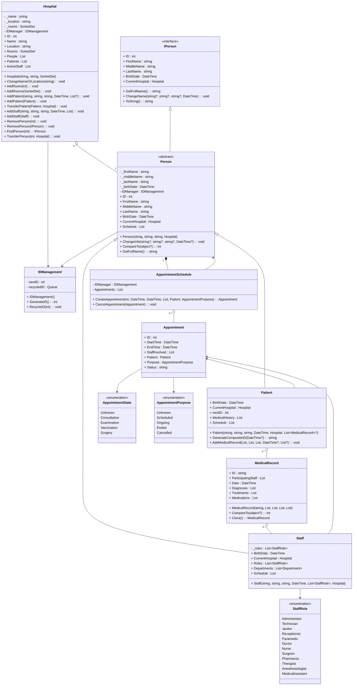

# **Опис предметної області**
У цьому проекті розробляється реалізація предметної області, що описує госпіталь. Після аналізу поданої предметної області було виокремлено 5 основних класи:
1.	Hospital (Госпіталь, як організація, що надає послуги пов'язані з здоров'ям кліенту. Головний клас цієї предметної області.);
2.  Staff (Робітник госпіталю);
3.	Patient (Паціент госпіталю, він же клієнт);
4.	AppointmentSchedule (Система запису, яка організує зустрічи персоналу та кліентів на обмежений відрізок часу.);
5.  Appointment (Записи зустріч між персоналом та кліентами. Клас який поеднує паціентів та працівників госпіталю.);

Для кожного з присутніх на діаграмі класів елементу було визначено його властивості та поведінку, які було позначено на діаграмі класів. Результат можна побачити на рисунку 1:

Рисунок 2 – Детальне проєктування елементів моделі предметної області

Далі наведено пояснення щодо кожного елементу моделі предметної області:

**Hospital**
Опис: Головний клас програми. Характеризує систему контролю госпіталю.
Поля:
- _name - Ім'я госпіталю.
- _location - Локація госпіталю.
- _rooms - Список кімнат.
- IDManager - Генератор ідентифікаційних номерів.
Властивості:
- ID - Ідентифікаційний номер госпіталю.
- Name - Ім’я госпіталю.
- Location - Локація госпіталю.
- Rooms - Список кімнат госпіталю.
- People - Список людей присутніх у госпіталі.
- Patients - Список паціентів госпіталю. Генерується від списку людей.
- ActiveStaff - Список персоналу госпіталю. Генерується від списку людей.

Методи:
- Hospital(string, string, SortedSet<int>) - Конструктор. Приймає та призначає ім’я, локацію, набір кімнат.
- ChangeNameOrLocation(string) - Дозволяє госпіталю змінити ім’я або локацію.
- AddRoom(int) - Дозволяє госпіталю додати кімнату.
- AddRooms(SortedSet<int>) - Дозволяє госпіталю додати список кімнат.
- AddPatient(string, string, string, DateTime, List<MedicalRecord>?) - Дозволяє госпіталю додати нового пацієнта з параметрами ім’я, фамілія, по батькові, дата народження, та - якщо існує - список медичних записів.
- AddPatient(Patient) - Дозволяє госпіталю додати вже існуючого пацієнта.
- TransferPatient(Patient, Hospital) - Дозволяє госпіталю перенести вже існуючого пацієнта в інший госпіталь.
- AddStaff(string, string, string, DateTime, List<StaffRole>, List<Department>) - Дозволяє госпіталю додати новий об’єкт персоналу.
- AddStaff(Staff) - Дозволяє додати існуючий персонал до госпіталю.
- RemovePerson(int) - Дозволяє видалити людину зі списків госпіталю за ідентифікатором.
- RemovePerson(Person) - Дозволяє видалити людину зі списків госпіталю за посиланням на об'єктом.
- FindPerson(int) - Дозволяє знайти людину зі спискиів госпіталю за ідентифікатором.
- TransferPerson(int, Hospital) - Дозволяє перевести людину зі спискиів госпіталю за ідентифікатором у інший госпіталь.

**IPerson**
Опис: Інтерфейс, що характеризує людину.
Властивості:  
- ID - Ідентифікаційний номер людини.
- FirstName - Ім’я людини.
- MiddleName - Фамілія людини.
- LastName - Ім’я по батькові людини.
- BirthDate - День народження людини.
- CurrentHospital - Госпіталь, в якому зараз знаходится людина.
Методи:
- GetFullName() - Повертає повне ім'я. 
- ChangeName(string?, string?, string?, DateTime) - Метод, який змінює ім’я та / або день народження людини.
- ToString() - Повертає об’єкт у форматі рядка.

**Person**
Опис: Абстрактний клас. Характеризує людину.
Поля:
- _firstName - Зберігає ім'я людини.
- _middleName - Зберігає фамілію людини.
- _lastName - Зберігає ім'я по батькові людини.
- _birthDate - Зберігає день народження людини.
- IDManager - Об'єкт допоміжног окласу IDManagement, який надає інструменти роботи з ідентифікаторами.
Властивості:
- ID - Ідентифікатор людини.
- FirstName - Ім’я людини.
- MiddleName - Фамілія людини.
- LastName - Ім’я по батькові людини.
- BirthDate - День народження людини.
- CurrentHospital - Госпіталь, в якому зараз знаходится людина.
- Schedule - Список планованих зустрічей людини.
Методи:
- Person(string, string, string, Hospital) - Конструктор класу. Призначає ім’я, фамілію, ім’я по батькові та госпіталь об'єкту.
- ChangeInfo(string?, string?, string?, DateTime?) - Метод, який змінює ім’я та / або день народження людини.
- CompareTo(object?) - Компонент інтерфесу IComparable. Дозволяє порівняти об'єкти классу Person.
- GetFullName() - Метод, який повертає повне ім’я людини.

**IDManagement**
Опис: Клас, що надає інструменти контролю ідентифікаторів іншим класам.
Поля:
- nextID - Вказує наступний ідентифікаційний номер.
- recycledID - Черга, в якій зберігаються ідентифікаційні номери видалених об’єктів.
Методи:
- IDManagement() - Конструктор класу.
- GenerateID() - Передає значення nextID та інкрементує його, якщо черга recycledID пуста. Інакше, передає перше значення черги.
- RecycleID() - Додає значення у чергу.

**Patient**
Опис: Клас, що характеризує пацієнта.
Властивості:
- BirthDate - День народження пацієнта. Має бути у діапазоні між 120 роками назад та сьогодні.
- CurrentHospital - Госпіталь, в якому зараз знаходится пацієнт.
- nextID - Наступний номер ідентифікатору медичного запису.
- MedicalHistory - Список медичних записів пацієнта.
- Schedule - Список планованих зустрічей пацієнта.
Методи:
- Patient(string, string, string, DateTime, Hospital, List<MedicalRecord>?) - Конструктор класу. Призначує ім’я, фамілію, та по батьокві. Також призначує дату народження, госпіталь, та якщо вони існують медичні записи пацієнта.
- GenerateCompositeID(DateTime?) - Генератор ідентифікаційного коду медичних записів.
- AddMedicalRecord(List<string>, List<string>, List<string>, DateTime?, List<Staff>?) - Метод створення медичних записів.

**MedicalRecord**
Опис: Клас, що характеризує медичний запис пацієнта.
Властивості:
- ID - Композитний ідентифікатор медичного запису у форматі символьного рядку. Складається з кількості медичних записів створенних сьогодні та дати створення. Формат: N-yyyy:MM:dd
- ParticipatingStaff - Список персоналу, присутнього на зустрічі запис до якої створюється.
- Date - Дата створення запису.
- Diagnoses - Список символьних рядків для діагнозів.
- Treatments - Список символьних рядків для приписаних медичних засобів.
- Medications - Список символьних рядків для приписаних медичних препаратів.
Методи:
- MedicalRecord(string, List<string>, List<string>, List<string>, List<Staff>) - Конструктор класу. Приймає композитний ключ, списки символьних рядків для властивостей Diagnoses, Treatments та Medications, та список персоналу присутнього на зустрічі.
- CompareTo(object?) - Метод інтерфейсу IComparable. Дозволяє порівнювати об'єкти типу MedicalRecord один з одним.
- Clone() - Метод інтерфейсу ICloneable. Дозволяє створити копію об'єкта класу MedicalRecord.

**Staff**
Опис: Клас, що характеризує пацієнта.
Поля:
- _roles - Зберігає список ролей персоналу.
Властивості:
- BirthDate - День народження персоналу. Не може бути вне діапазону 18 років назад, 60 років назад.
- CurrentHospital - Госпіталь, в якому зараз знаходится персонал.
- Roles - Список ролей персоналу.
- Departments - Список департаментів, в яких працює персонал.
- Schedule - Список планованих зустрічей персоналу.
Методи:
- Staff(string, string, string, DateTime, List<StaffRole>, Hospital) - Конструктор класу. Призначує ім’я, фамілію, та по батькові. Також призначує день народження, список ролей персоналу, госпіталь.

**StaffRole**
Опис: Перелічення, що характеризує роль персоналу в госпіталі.
Значення:
- Administrator - Адміністратор.
- Technician - Технік.
- Janitor - Прибиральник.
- Receptionist - Портьє.
- Paramedic - Фельдшер.
- Doctor - Лікар.
- Nurse - Медсестра.
- Surgeon - Хірург.
- Pharmacist - Фармацевт.
- Therapist - Терапевт.
- Anesthesiologist - Анестезіолог.
- MedicalAssistant - Медичний Ассистент.

**AppointmentSchedule**
Опис: Клас, який надає методи контролю над зустрічами.
Поля:
- IDManager - Об’єкт класу IDManagement, який генерує ідентифікаційні номери для зустрічей.
- Appointments - Список, в якому зберігаються зустрічі.
 
Методи:
- CreateAppointment(int, DateTime, DateTime, List<Staff>, Patient, AppointmentPurpose) - Метод, який створює зустрічі, синхронизує їх між об'єктами персоналу та пацієнтів, та додає їх у словарі.
- CancelAppointment(Appointment) - Змінює стан зустрічі на "Canceled".

**Appointment**
Опис: Клас, що характеризує зустріч пацієнта з персоналом.
Поля:
- _roomId
- _startTime
- _endTime
- _staff
- _appointee
- _purpose
- _state
Властивості:
- RoomID - Кімната, в якій буде проходити зустріч.
- StartTime - Час, в який починається зустріч.
- EndTime - Час, в який закінчується зустріч.
- Staff - Список персоналу, який має бути присутній на зустрічі.
- Appointee - Пацієнт, який має бути присутній на зустрічі.
- Purpose - Мета зустрічі.
- State - Стан зустрічі.
Методи:
- Appointment(int, DateTime, DateTime, List<Staff>, Patient, AppointmentPurpose) - Конструктор класу. Приймає номер кімнати, час початку та кінця зустрічі, список персоналу, пацієнта, та мету зустрічі.

**AppointmentPurpose**
Опис: Перелічення, що характеризує мету зустрічі.
Значення:
- Unknown - Технічне значення для невідомої мети зустрічі.
- Consultation - Консультація.
- Examination - Огляд.
- Vaccination - Вакцинація.
- Surgery - Хірургія.

**AppointmentState**
Опис: Перелічення, що характеризує стан зустрічі.
Значення:
- Unknown - Технічне значення для невідомого стану зустрічі.
- Scheduled - За розкладом.
- Ongoing - Триває.
- Ended - Завершено.
- Canceled - Скасовано.